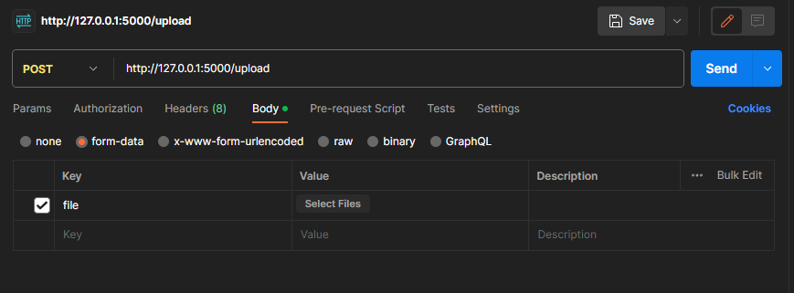

<div align="center">
  
</div>

<h1 align="center" id="head"><b>REST API WITH FLASK [EM PRODUÇÃO]</b></h1>

<p align="center"><b> - LEARN TO BUILD RESTful APIs WITH PYTHON AND FLASK -</b></p>
<br>

<h1>Guia de Introdução ao Flask</h1>

<p align="justify">&emsp; Este guia tem como objetivo fornecer uma introdução prática ao desenvolvimento web utilizando o framework Flask em Python. Ele abordará conceitos básicos, criação de endpoints de CRUD (Create, Read, Update, Delete), upload e download de arquivos, uso de decorators e wrappers.</p>

<h2 align="center">S U M A R I O</h2>
<br>

1. [Pré-requisitos](#pre)
1. [Introdução a RESTful APIs](#intro)
2. [Configurações iniciais](#setup)
    1. [Endpoints de CRUD](#endpoints)
3. [Recursos Adicionais](#recursos)
4. [Decorators e Wrappers](#decoratorsWrappers)
    1. [Como usar Decorators e Wrapper](#useDecoWrapper)
5. [Diferença entre API RESTful e REST](#teo)
1. [Criando ambientes virtuais](#env)


<br>

<h2 id="pre">Pré-requisitos</h2>

<p align="justify">&emsp;Antes de começar, certifique-se de ter o Python instalado. Você pode verificar a versão do Python instalada digitando o seguinte comando no terminal:</p>

```powershell
python --version
```

<p align="justify">&emsp;Além disso, você precisará do Flask instalado. Caso ainda não tenha instalado, execute o seguinte comando:</p>

```powershell
pip install Flask
```

<h2 id="intro">Introdução a RESTful APIs</h2>
<p align="justify">&emsp; As APIs RESTful (Representational State Transfer) são uma abordagem popular para criar interfaces de programação de aplicativos que facilitam a comunicação entre sistemas distribuídos. Essas APIs adotam princípios arquiteturais que promovem a escalabilidade, a simplicidade e a interoperabilidade.</p>

<p align="justify">&emsp; Uma API RESTful é projetada para se assemelhar à estrutura da web, utilizando os métodos HTTP (GET, POST, PUT, DELETE, etc.) para manipular recursos. Essa abordagem oferece uma maneira uniforme de interagir com esses recursos, tornando a API fácil de entender e usar.</p>

<h3>As principais características de uma API RESTful incluem:</h3>
<br>

1. <b>Estado do Cliente e Stateless:</b> Cada solicitação do cliente para o servidor deve conter todas as informações necessárias para compreender e processar a solicitação. O servidor não mantém informações de estado entre solicitações. Isso promove a escalabilidade e a confiabilidade da API.

1. <b>Recursos e URIs:</b> Os recursos, que representam entidades do mundo real, são manipulados através de URLs (Uniform Resource Identifiers). As URIs devem ser consistentes e intuitivas para facilitar a navegação e a interação com a API.

1. <b>Métodos HTTP:</b> As operações de manipulação de recursos (criação, leitura, atualização, exclusão) são realizadas usando os métodos padrão do protocolo HTTP, como GET, POST, PUT e DELETE. Cada método possui um propósito específico.

1. <b>Representações:</b> Os recursos são representados em diferentes formatos, como JSON, XML ou HTML. As APIs RESTful fornecem uma representação clara dos dados, permitindo a fácil interpretação e processamento.

1. <b>Códigos de Status HTTP:</b> As respostas do servidor incluem códigos de status HTTP que indicam o resultado da solicitação, como "200 OK" para sucesso, "404 Not Found" para recurso não encontrado, entre outros.

1. <b>Hypermedia (HATEOAS):</b> É um conceito que indica que as respostas da API devem conter links para outros recursos relacionados. Isso permite que os clientes naveguem pela API de maneira autônoma, sem depender de documentação externa.

1. <b>Interface Uniforme:</b> Uma API RESTful segue uma interface uniforme, o que significa que os princípios subjacentes são consistentes em toda a API, facilitando a previsibilidade e a compreensão.

<h2 id="setup">Criando uma Aplicações Flask Básica</h2>

<p align="justify">&emsp;Vamos começar criando uma aplicação Flask simples que responde a uma rota básica:</p>

```python
from flask import Flask

app = Flask(__name__)

@app.route('/')
def hello():
    return "Olá, Flask!"

if __name__ == '__main__':
    app.run(debug=True,  use_reloader=False)
```

<p align="justify">&emsp;Navegue até <a href="http://localhost:5000"><u>http://localhost:5000</u></a> no seu navegador para ver a mensagem "Olá, Flask!".</p>

<h3 id="endpoints">Endpoints de CRUD</h3>

<p align="justify">&emsp;Agora, vamos criar endpoints para realizar operações CRUD (Create, Read, Update, Delete) em um recurso, por exemplo, uma lista de tarefas:</p>

```python
from flask import Flask, request, jsonify

app = Flask(__name__)

tasks = []

# Criação de tarefa
@app.route('/tasks', methods=['POST'])
def create_task():
    new_task = request.json
    tasks.append(new_task)
    return jsonify({"message": "Task created successfully"})

# Listagem de todas as tarefas
@app.route('/tasks', methods=['GET'])
def get_tasks():
    return jsonify(tasks)

# Leitura de tarefa por ID
@app.route('/tasks/<int:task_id>', methods=['GET'])
def get_task(task_id):
    if task_id < len(tasks):
        return jsonify(tasks[task_id])
    return jsonify({"message": "Task not found"}), 404

# Atualização de tarefa por ID
@app.route('/tasks/<int:task_id>', methods=['PUT'])
def update_task(task_id):
    if task_id < len(tasks):
        updated_task = request.json
        tasks[task_id] = updated_task
        return jsonify({"message": "Task updated successfully"})
    return jsonify({"message": "Task not found"}), 404

# Exclusão de tarefa por ID
@app.route('/tasks/<int:task_id>', methods=['DELETE'])
def delete_task(task_id):
    if task_id < len(tasks):
        tasks.pop(task_id)
        return jsonify({"message": "Task deleted successfully"})
    return jsonify({"message": "Task not found"}), 404

if __name__ == '__main__':
    app.run(debug=True,  use_reloader=False)
```

<h3>Upload e Download de Arquivos</h3>

<p align="justify">&emsp;Upload e download de arquivos, como por exemplo, imagens:</p>

```python
from flask import Flask, request, send_from_directory
import os

app = Flask(__name__)

app.config['UPLOAD_FOLDER'] = 'uploads'

if not os.path.exists(app.config['UPLOAD_FOLDER']):
    os.makedirs(app.config['UPLOAD_FOLDER'])

@app.route('/upload', methods=['POST'])
def upload_file():
    if 'file' not in request.files:
        return jsonify({"message": "No file part"})
    
    file = request.files['file']
    
    if file.filename == '':
        return jsonify({"message": "No selected file"})
    
    file.save(os.path.join(app.config['UPLOAD_FOLDER'], file.filename))
    return jsonify({"message": "File uploaded successfully"})

@app.route('/uploads/<filename>')
def download_file(filename):
    return send_from_directory(app.config['UPLOAD_FOLDER'], filename)

if __name__ == '__main__':
    app.run(debug=True,  use_reloader=False)
```


<i>Uso de postman para upload de arquivos</i><br>

<h3 id="decoratorsWrappers">Decorators e Wrappers</h3>

<p align="justify">&emsp;O Flask permite o uso de decoradores e wrappers para adicionar funcionalidades a funções específicas. Vamos criar um exemplo de autenticação simples:</p>

<h3>Decorators</h3>

<p align="justify">&emsp;Os decoradores são funções que envolvem outras funções ou métodos, permitindo a adição de comportamentos extras sem modificar o código da função original. No Flask, os decoradores são comumente usados para definir rotas e adicionar funcionalidades a elas. Aqui está um exemplo simples:</p>

```python
from flask import Flask

app = Flask(__name__)

def my_decorator(func):
    def wrapper():
        print("Something is happening before the function is called.")
        func()
        print("Something is happening after the function is called.")
    return wrapper

@app.route('/')
@my_decorator
def hello():
    return "Hello, Flask!"

if __name__ == '__main__':
    app.run(debug=True,  use_reloader=False)
```

<p align="justify">&emsp;Neste exemplo, o decorator my_decorator envolve a função hello(), imprimindo mensagens antes e depois da chamada da função.</p>

<p align="justify">&emsp;No exemplo, o wrapper requires_auth verifica a autenticação antes de permitir que a função original seja executada. A função wraps é usada para garantir que a função original (no caso, protected_route()) mantenha seu nome e documentação.</p>

<h3>Wrappers</h3>

<p align="justify">&emsp;Wrappers são funções intermediárias que envolvem ou "embrulham" outras funções. Eles são frequentemente usados em conjunto com decoradores para adicionar comportamentos extras. No contexto do Flask, os wrappers são usados para implementar verificações, autenticação, manipulação de erros e muito mais.</p>

<p align="justify">&emsp;Aqui está um exemplo de um wrapper que verifica a autenticação antes de permitir o acesso a uma rota:</p>

```python
from functools import wraps
from flask import Flask, request, jsonify

app = Flask(__name__)

def requires_auth(func):
    @wraps(func)
    def wrapper(*args, **kwargs):
        auth_token = request.headers.get('Authorization')
        if auth_token == 'mysecrettoken':
            return func(*args, **kwargs)
        else:
            return jsonify({"message": "Authentication failed"}), 401
    return wrapper

@app.route('/protected')
@requires_auth
def protected_route():
    return jsonify({"message": "This is a protected route"})

if __name__ == '__main__':
    app.run(debug=True,  use_reloader=False)
```


<h3 id="useDecoWrapper">Como Usar Decorators e Wrappers</h3>

Para criar seus próprios decoradores e wrappers, siga estas etapas:

1. Defina sua função de decorator ou wrapper. Isso pode ser uma função comum que envolve ou modifica outra função.

1. Se você estiver criando um decorator, normalmente usará a sintaxe @nome_do_decorator acima da função que deseja decorar. Se estiver usando um wrapper, você pode usar o wrapper diretamente para envolver a função.

1. Certifique-se de usar functools.wraps(func) quando criar um wrapper para preservar o nome e a documentação da função original.

1. Personalize a lógica dentro do decorator ou wrapper conforme necessário para adicionar a funcionalidade desejada.

1. Decoradores e wrappers permitem modularizar e reutilizar funcionalidades em seus aplicativos. Eles ajudam a manter o código organizado, legível e permitem adicionar ou remover recursos sem afetar drasticamente a estrutura existente.


<h3>Banco de Dados [EXTRA]</h3>

<p align="justify">&emsp;Integrar um banco de dados ao seu aplicativo é fundamental. O Flask não possui um ORM (Object-Relational Mapping) integrado, mas você pode usar extensões populares como o SQLAlchemy para lidar com o banco de dados.</p>

```python
from flask import Flask
from flask_sqlalchemy import SQLAlchemy

app = Flask(__name__)
app.config['SQLALCHEMY_DATABASE_URI'] = 'sqlite:///mydatabase.db'
db = SQLAlchemy(app)

class Task(db.Model):
    id = db.Column(db.Integer, primary_key=True)
    title = db.Column(db.String(100), nullable=False)

if __name__ == '__main__':
    app.run(debug=True,  use_reloader=False)
```

<h3>Extensões do Flask</h3>

<p align="justify">&emsp;O Flask possui uma rica ecossistema de extensões que facilitam a implementação de recursos comuns, como autenticação, formulários, e-mails, entre outros. Algumas extensões populares incluem Flask-WTF (formulários), Flask-Login (autenticação de usuário), Flask-Mail (envio de e-mails), entre outras.</p>

```powershell
pip install Flask-WTF Flask-Login Flask-Mail
```


<h3>Estrutura de Projeto</h3>


<p align="justify">&emsp;À medida que seu aplicativo cresce, é útil organizar seus arquivos em uma estrutura de projeto. Um exemplo simples pode ser:

```powershell
myapp/
├── app.py
├── templates/
    └── index.html
```

<h3 id="recursos">Recursos Adicionais</h3>

Além disso, para aprofundar seus conhecimentos, considere explorar:

- Testes Unitários: Aprenda a testar seu aplicativo usando bibliotecas como unittest ou pytest.
- Autenticação e Autorização: Implemente autenticação de usuário e controle de acesso para proteger rotas sensíveis.
- API RESTful: Aprenda como criar uma API RESTful completa usando o Flask.
- Blueprints: Organize seu aplicativo em módulos reutilizáveis chamados blueprints.
- Segurança: Explore práticas recomendadas para proteger seu aplicativo contra vulnerabilidades comuns.

<h2 id="teo">Diferença entre API REST e RESTFUL</h2>

<b>"API REST" e "API RESTful"</b> são termos frequentemente usados para se referir a APIs que seguem os princípios da arquitetura REST (Representational State Transfer). Embora esses termos sejam muitas vezes usados de forma intercambiável, eles têm significados ligeiramente diferentes.

### API REST (API Web RESTful):

Uma API REST (ou simplesmente API Web RESTful) é uma interface de programação de aplicativos que segue os princípios arquiteturais definidos pelo estilo de arquitetura REST. Uma API REST é projetada para permitir a comunicação entre sistemas distribuídos e, em muitos casos, é implementada usando protocolos HTTP. Ela utiliza os verbos HTTP (GET, POST, PUT, DELETE, etc.) para manipular recursos de forma uniforme.

### API RESTful:

O termo "API RESTful" é frequentemente usado para se referir a uma API que adere rigorosamente aos princípios do estilo de arquitetura REST. Uma API é considerada "RESTful" quando segue todas ou a maioria das características definidas por Roy Fielding em sua tese de doutorado (2000) sobre a arquitetura REST. Isso inclui, entre outros aspectos, a utilização correta dos métodos HTTP, a semântica correta dos códigos de status, a manipulação de recursos através de URLs, a ausência de estado (stateless), a utilização de hypermedia (HATEOAS) para a navegação entre recursos, entre outros princípios.

Portanto, a diferença está principalmente na terminologia:

<b>API REST:</b> Pode ser uma API que segue os princípios da arquitetura REST, mas pode não aderir estritamente a todos eles.

<b>API RESTful:</b> É uma API que segue rigorosamente os princípios e práticas da arquitetura REST.
Na prática, muitas vezes você ouvirá ambos os termos usados de maneira intercambiável para descrever APIs que utilizam os princípios da arquitetura REST, independentemente de aderirem estritamente a todos os detalhes.


<h2 id='env'>Criação Ambiente Virtual em Python ( Em linux )</h2>

Para criar um ambiente virtual em Python, você pode usar a biblioteca padrão chamada `venv`. Siga as etapas abaixo para criar e ativar um ambiente virtual usando o `venv`:

### **(Opçãp 1) Criação - miniconda**

1. Baixar o instalador miniconda:
```
wget https://repo.anaconda.com/miniconda/Miniconda3-latest-Linux-x86_64.sh
```
2. Executando o instalador:
```
bash Miniconda3-latest-Linux-x86_64.sh
```
3. Iniciar coda:
```
conda init
```
4. Listar env existentes:
```
conda env list
```
5. Criar env com pytoh3.10:
```
conda create -n <name env> python=3.10
```
6. Ativar env:
```
conda activate <name env>
```

7. Deletar .sh
```
rm Miniconda3-latest-Linux-x86_64.sh
```


### **(Opção 2) Criação - venv**


1. Verifique se o Python 3 está instalado:
Abra o terminal e execute o seguinte comando:
```
python3 --version
```
2. Se o Python 3 já estiver instalado, você verá a versão instalada. Caso contrário, siga para o próximo passo.

3. Instale o Python 3:

No terminal, execute os comandos apropriados de acordo com a distribuição Linux que você está usando:

```
sudo apt install python3
```

4. Instale o pip:

```
sudo apt install python3-pip
```

5. Instale o pacote venv:
O pacote venv permite criar ambientes virtuais isolados. No terminal, execute o seguinte comando:

```
sudo apt install python3-venv
```

6. Para criação do ambiente virtual:
Navegue até o diretório onde deseja criar o ambiente virtual.

7. Digite o seguinte comando para criar um novo ambiente virtual:

```
python3 -m venv nome_do_ambiente
```

*Substitua "nome_do_ambiente" pelo nome que você deseja dar ao seu ambiente virtual.*

8. Para ativar o ambiente virtual, execute o comando apropriado de acordo com o seu sistema operacional:

```
source nome_do_ambiente/bin/activate
```

9. Agora, o ambiente virtual está ativado. Você pode instalar pacotes e executar seus projetos dentro dele sem afetar o ambiente global do Python.

Quando você terminar de trabalhar com o ambiente virtual, pode desativá-lo usando o comando:

```
deactivate
```

<h2 id="Equipe">Equipe</h2><br>

<div align="center">

|     Desenvolvedor              |           GitHub             |       LinkedIn     |
|--------------------------------|------------------------------|--------------------|
|👤 João Vitor Moraes            |<https://github.com/JohKemPo>   |<https://www.linkedin.com/in/joao-vitor-de-moraes/>|
